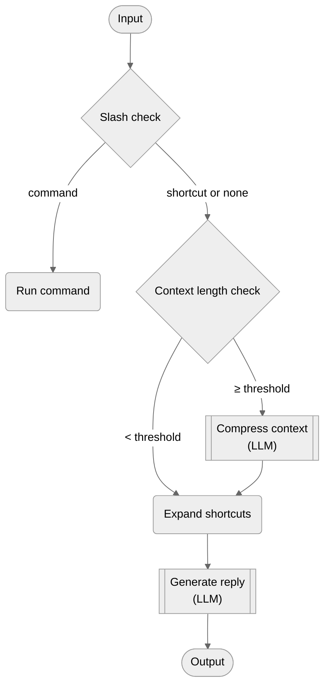

# Architecture

## Dark Age: Chat Only

```mermaid
%%{init: {'theme': 'neutral', 'flowchart': {'curve': 'basis'}}}%%
flowchart TD
    input(["Input"]) --> slash{"Slash check"}
    slash -->|command| run("Run command")
    slash -->|"shortcut or none"| check{"Context length check"}
    check -->|"≥ threshold"| compress[["Compress context<br>(LLM)"]]
    check -->|"< threshold"| expand("Expand shortcuts")
    compress --> expand
    expand --> reply[["Generate reply<br>(LLM)"]]
    reply --> output(["Output"])
```
